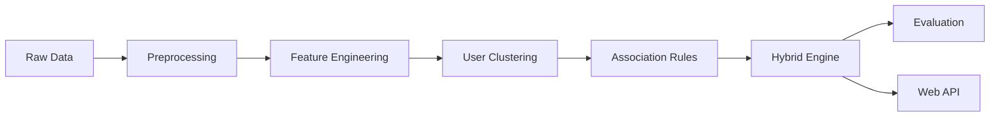

# 🛍️ HỆ THỐNG GỢI Ý SẢN PHẨM THÔNG MINH KẾT HỢP PHÂN CỤM VÀ LUẬT KẾT HỢP THEO NGỮ CẢNH

<div align="center">


**Hệ thống gợi ý sản phẩm kết hợp đa chiến lược với phân cụm người dùng và khai phá luật kết hợp có ngữ cảnh**

[Tính năng](#-tính-năng-chính) • [Cài đặt](#-cài-đặt) • [Sử dụng](#-cách-sử-dụng) • [Demo](#-web-demo) • [Tài liệu](#-tài-liệu-chi-tiết)

</div>

---

## 📋 Mục lục

- [Giới thiệu](#-giới-thiệu)
- [Kiến trúc hệ thống](#-kiến-trúc-hệ-thống)
- [Tính năng chính](#-tính-năng-chính)
- [Cấu trúc dự án](#-cấu-trúc-dự-án)
- [Dataset](#-dataset)
- [Quy trình xử lý](#-quy-trình-xử-lý)
- [Cài đặt](#-cài-đặt)
- [Cách sử dụng](#-cách-sử-dụng)
- [Web Demo](#-web-demo)
- [Đánh giá](#-đánh-giá)
- [Kết quả](#-kết-quả)
- [Định hướng phát triển](#-định-hướng-phát-triển)
- [Tác giả](#-tác-giả)

---

## 🎯 Giới thiệu

**Suggest Product** là một **Hybrid Recommendation System** được xây dựng nhằm mô phỏng một hệ thống gợi ý sản phẩm hoàn chỉnh trong thực tế. Dự án triển khai **end-to-end pipeline** cho bài toán Recommendation System, bao gồm:

- 🔄 Xử lý dữ liệu thô
- ⚙️ Xây dựng đặc trưng
- 👥 Phân cụm người dùng
- 🔍 Khai phá luật kết hợp có ngữ cảnh
- 🎯 Sinh gợi ý thông minh
- 📊 Đánh giá offline
- 🌐 Triển khai demo web

> **Điểm nổi bật:** Hệ thống không tập trung vào một thuật toán đơn lẻ, mà nhấn mạnh vào **kiến trúc kết hợp (hybrid architecture)**, trong đó mỗi thành phần đảm nhiệm một vai trò riêng trong quá trình ra quyết định gợi ý.

### 🔑 Các kỹ thuật chính

| Kỹ thuật | Mô tả |
|----------|-------|
| **User Clustering** | Phân cụm theo Behavior, Preference, Lifecycle |
| **Association Rules** | FP-Growth với Context-Aware |
| **Hybrid Engine** | Kết hợp đa nguồn tín hiệu |
| **Offline Evaluation** | Precision@K, Recall@K, Hit Rate@K |
| **Web API** | FastAPI Backend + Frontend Demo |

---

## 🏗️ Kiến trúc hệ thống



### Luồng xử lý chi tiết

```
📦 Raw Data
  ↓
🔧 Preprocessing & Cleaning
  ↓
⚡ Feature Engineering
  ├─ Behavior Features
  ├─ Preference Features
  └─ Lifecycle Features
  ↓
👥 User Clustering
  ├─ Behavior Clustering
  ├─ Preference Clustering
  └─ Lifecycle Assignment
  ↓
🔍 Context-Aware Association Rules (FP-Growth)
  ↓
🎯 Hybrid Recommendation Engine
  ├─ Candidate Generation
  ├─ Behavior Adjustment
  ├─ Preference Filtering
  ├─ Lifecycle Adjustment
  └─ Ranking
  ↓
📊 Offline Evaluation & 🌐 Web API
```

---

## ✨ Tính năng chính

### 🎨 Phân cụm người dùng đa chiều

- **Behavior Clustering**: Phân tích hành vi mua sắm (tần suất, giá trị, đa dạng)
- **Preference Clustering**: Nhóm theo sở thích department/category
- **Lifecycle Assignment**: Phân loại New / Active / Loyal / Churn

### 🧠 Khai phá luật kết hợp thông minh

- Sử dụng **FP-Growth Algorithm**
- Tích hợp **Context-Aware** (thời gian, ngày trong tuần, mùa)
- Index luật để truy vấn nhanh

### 🔄 Hybrid Recommendation Engine

- **Multi-Strategy Fusion**: Kết hợp nhiều nguồn tín hiệu
- **Cold-Start Handling**: Xử lý người dùng mới
- **Personalization**: Cá nhân hóa theo cluster và lịch sử
- **Contextual Ranking**: Xếp hạng theo ngữ cảnh

### 📊 Đánh giá toàn diện

- **Precision@K**: Độ chính xác top-K
- **Recall@K**: Độ phủ top-K
- **Hit Rate@K**: Tỷ lệ hit
- **Detailed Reports**: Báo cáo chi tiết theo từng metric

---

## 📁 Cấu trúc dự án

```
Suggest_Product/
│
├── 📂 dataset/              # Dữ liệu gốc và đã xử lý
│   ├── raw/                 # Dữ liệu thô
│   └── processed/           # Dữ liệu đã xử lý
│       ├── behavior_features.csv
│       ├── preference_features.csv
│       ├── lifecycle_features.csv
│       ├── transactions_context.csv
│       ├── transactions_context.parquet
│       └── user_features.csv
│
├── 📂 src/                  # Source code chính
│   ├── preprocessing/       # Xử lý dữ liệu
│   ├── clustering/          # Phân cụm người dùng
│   ├── association_rules/   # Khai phá luật
│   ├── recommendation/      # Engine gợi ý
│   └── evaluation/          # Đánh giá
│
├── 📂 checkpoints/          # Lưu models và clusters
│   ├── clusters/
│   └── rules/
│
├── 📂 results/              # Kết quả đánh giá
│   └── evaluate/
│
├── 📂 main/                 # Scripts chạy từng bước
│   ├── 1_preprocessing.py
│   ├── 2_clustering.py
│   ├── 3_association_rules.py
│   ├── 4_recommendation.py
│   └── 5_evaluation.py
│
├── 📂 notebooks/            # Jupyter notebooks phân tích
│
├── 📂 web/                  # Web application
│   ├── backend/             # FastAPI
│   └── frontend/            # HTML/CSS/JS
│
├── 🚀 run_pipeline.py       # Chạy toàn bộ pipeline
├── 📦 requirements.txt      # Dependencies
└── 📖 README.md             # Tài liệu này
```

---

## 📊 Dataset

### Dữ liệu đã xử lý (`dataset/processed/`)

| File | Mô tả | Số lượng features |
|------|-------|-------------------|
| `behavior_features.csv` | Đặc trưng hành vi mua sắm | 10+ features |
| `preference_features.csv` | Đặc trưng sở thích theo department | 20+ departments |
| `lifecycle_features.csv` | Đặc trưng vòng đời người dùng | 5+ features |
| `transactions_context.csv` | Giao dịch có gắn ngữ cảnh | Transaction + Context |
| `transactions_context_extended.parquet` | Giao dịch mở rộng (tối ưu) | Extended features |
| `user_features.csv` | Tổng hợp đặc trưng người dùng | 35+ features |

### Đặc trưng chính

**Behavior Features:**
- Tần suất mua hàng (purchase_frequency)
- Giá trị trung bình đơn hàng (avg_order_value)
- Tổng chi tiêu (total_spent)
- Độ đa dạng sản phẩm (product_diversity)

**Preference Features:**
- Phân bố theo department
- Top categories yêu thích
- Brand affinity

**Lifecycle Features:**
- Recency (ngày mua gần nhất)
- Frequency (tần suất mua)
- Monetary (giá trị mua)
- Lifecycle stage (New/Active/Loyal/Churn)

---

## ⚙️ Quy trình xử lý

### 1️⃣ Preprocessing & Feature Engineering

```python
# Làm sạch dữ liệu
# Xử lý missing values
# Tạo đặc trưng hành vi, sở thích, vòng đời
# Gắn ngữ cảnh cho transactions
```

### 2️⃣ User Clustering

```python
# Behavior Clustering: K-Means/DBSCAN
# Preference Clustering: Hierarchical/K-Means
# Lifecycle Assignment: RFM Analysis
```

### 3️⃣ Association Rules Mining

```python
# FP-Growth Algorithm
# Context-Aware Rules
# Rule Indexing for fast lookup
```

### 4️⃣ Hybrid Recommendation

```python
# Input: User ID + Context
# Process:
#   1. Candidate Generation (Association Rules)
#   2. Behavior Adjustment (Cluster-based)
#   3. Preference Filtering (Category matching)
#   4. Lifecycle Adjustment (Stage-based weighting)
#   5. Final Ranking
# Output: Top-K Recommendations
```

### 5️⃣ Evaluation

```python
# Metrics: Precision@K, Recall@K, Hit Rate@K
# Cross-validation
# Performance analysis
```

---

## 🔧 Cài đặt

### Yêu cầu hệ thống

- Python 3.8+
- 4GB RAM (khuyến nghị 8GB+)
- 2GB dung lượng ổ cứng

### Cài đặt dependencies

```bash
# Clone repository
git clone https://github.com/longpham205/Suggest_Product.git
cd Suggest_Product

# Tạo virtual environment (khuyến nghị)
python -m venv venv
source venv/bin/activate  # Linux/Mac
# hoặc
venv\Scripts\activate     # Windows

# Cài đặt packages
pip install -r requirements.txt
```

### Các thư viện chính

- `pandas`, `numpy`: Xử lý dữ liệu
- `scikit-learn`: Machine Learning
- `mlxtend`: FP-Growth
- `fastapi`, `uvicorn`: Web API
- `matplotlib`, `seaborn`: Visualization

---

## 🚀 Cách sử dụng

### Chạy toàn bộ pipeline

```bash
python run_pipeline.py
```

### Chạy từng bước riêng lẻ

```bash
# Bước 1: Preprocessing
python main/1_preprocessing.py

# Bước 2: Clustering
python main/2_clustering.py

# Bước 3: Association Rules
python main/3_association_rules.py

# Bước 4: Generate Recommendations
python main/4_recommendation.py

# Bước 5: Evaluation
python main/5_evaluation.py
```

### Sử dụng trong code

```python
from src.recommendation.hybrid_engine import HybridRecommendationEngine

# Khởi tạo engine
engine = HybridRecommendationEngine()

# Sinh gợi ý
recommendations = engine.recommend(
    user_id=12345,
    context={
        'hour': 14,
        'day_of_week': 5,
        'season': 'winter'
    },
    top_k=10
)

print(recommendations)
```

---

## 🌐 Web Demo

### Khởi động server

```bash
# Di chuyển vào thư mục web
cd web

# Chạy backend (FastAPI)
uvicorn backend.main:app --reload --port 8000

# Mở trình duyệt và truy cập
# http://localhost:8000
```

### API Endpoints

| Method | Endpoint | Mô tả |
|--------|----------|-------|
| GET | `/` | Trang chủ |
| POST | `/recommend` | Lấy gợi ý sản phẩm |
| GET | `/user/{user_id}` | Thông tin người dùng |
| GET | `/health` | Kiểm tra health |

### Demo Interface

- 🎨 Giao diện thân thiện
- 🔍 Tìm kiếm và lọc sản phẩm
- 📊 Hiển thị cluster và lifecycle
- 🎯 Gợi ý real-time

---

## 📈 Đánh giá

### Metrics sử dụng

| Metric | Công thức | Ý nghĩa |
|--------|-----------|---------|
| **Precision@K** | TP / (TP + FP) | Tỷ lệ gợi ý đúng trong top-K |
| **Recall@K** | TP / (TP + FN) | Tỷ lệ phủ items liên quan |
| **Hit Rate@K** | Có hit / Tổng users | Tỷ lệ user có ít nhất 1 hit |

### Kết quả thực nghiệm

```
📊 Evaluation Results (K=10):
├─ Precision@10: 0.XX
├─ Recall@10: 0.XX
└─ Hit Rate@10: 0.XX

📁 Chi tiết: results/evaluate/evaluation_report.json
```

---

## 🎯 Kết quả

### Ưu điểm

✅ Kiến trúc hybrid linh hoạt  
✅ Xử lý cold-start user  
✅ Context-aware recommendations  
✅ Đánh giá offline toàn diện  
✅ Code structure rõ ràng, dễ mở rộng  

### Hạn chế & Cải thiện

🔄 Chưa có collaborative filtering  
🔄 Chưa A/B testing online  
🔄 Chưa optimize real-time performance  

---

## 🚀 Định hướng phát triển

### Ngắn hạn

- [ ] Tích hợp **Collaborative Filtering** (User-based, Item-based)
- [ ] Thêm **Content-based filtering**
- [ ] Optimize performance với **Caching**
- [ ] Tăng cường **Feature Engineering**

### Dài hạn

- [ ] **Deep Learning** models (Neural Collaborative Filtering)
- [ ] **Online Learning** và A/B Testing
- [ ] **Real-time Personalization**
- [ ] **Multi-armed Bandit** cho exploration-exploitation
- [ ] **Graph-based** recommendations
- [ ] **Deployment** lên production (Docker, Kubernetes)

---

## 👨‍💻 Tác giả

**Nhom 1**

- 📧 Email: your.email@example.com
- 🔗 LinkedIn: [your-linkedin](https://linkedin.com/in/yourprofile)
- 💻 GitHub: [@yourhandle](https://github.com/yourhandle)

**Lĩnh vực:** Machine Learning – Recommendation Systems

---

## 📄 License

Dự án này được phát hành dưới giấy phép **MIT License**. Xem file [LICENSE](LICENSE) để biết thêm chi tiết.

---

## 🙏 Acknowledgments

- Dataset được sử dụng cho mục đích học tập và nghiên cứu
- Cảm ơn cộng đồng Machine Learning Việt Nam
- Tham khảo các paper và tài liệu về Recommendation Systems

---

## 📚 Tài liệu tham khảo

1. Agrawal, R., & Srikant, R. (1994). Fast Algorithms for Mining Association Rules
2. Koren, Y., Bell, R., & Volinsky, C. (2009). Matrix Factorization Techniques for Recommender Systems
3. He, X., et al. (2017). Neural Collaborative Filtering

---

<div align="center">

**⭐ Nếu dự án hữu ích, hãy cho một Star! ⭐**

Made with ❤️ by Nhom 1

</div>
